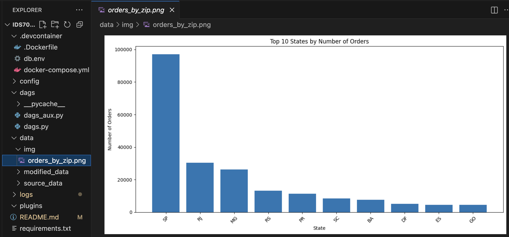
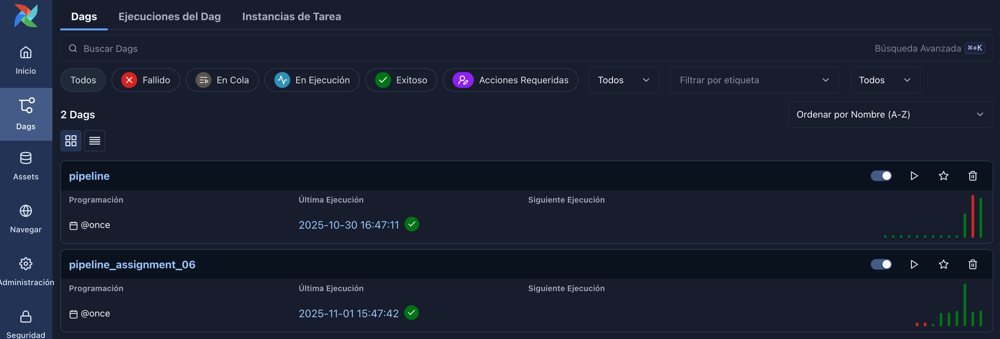
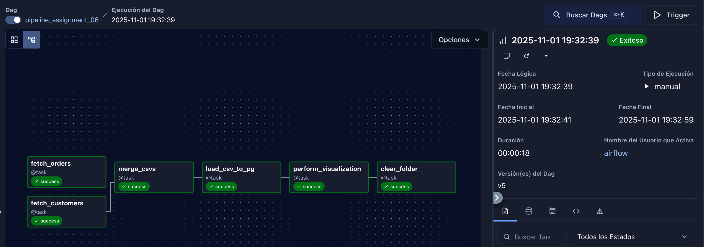

# IDS706_assignment_06: Airflow ETL Pipeline for E-commerce Data Analysis
This is a repository for [assignment 6](https://sordid-plot-c78.notion.site/Airflow-In-Class-Exercise-28d45dca7a3e80ed9ad8c1636948f103): Major Assignment with data orchestration, dev container, and database

## Project Overview
This project implements an end-to-end data pipeline using Apache Airflow that processes e-commerce data from [Olist (Brazilian E-commerce)](https://www.kaggle.com/datasets/bytadit/ecommerce-order-dataset). The pipeline performs data ingestion, transformation, merging, and analysis, culminating in an automated visualization and database storage.

## Pipeline Architecture

### **DAG Structure:**
- **DAG ID**: `pipeline_assignment_06`
- **Schedule**: One-time execution (`@once`)
- **Data Flow**: Sequential with parallelizable components

### **Data Sources:**
- **Customers Dataset**: Customer demographic and location data
- **Orders Dataset**: Order transactions and timestamps

## Pipeline Steps

### **1. Data Ingestion & Transformation**
- **`fetch_customers`**: Loads customer data and transforms zip codes
- **`fetch_orders`**: Loads order data and changes timestamps
- **Transformations Applied**:
  - Customer zip code prefix normalization
  - Order timestamp standardization (+1 day adjustment)

### **2. Data Integration**
- **`merge_csvs`**: Performs inner join between customers and orders datasets
- Creates unified dataset for analysis

### **3. Database Loading**
- **`load_csv_to_pg`**: Loads merged data into PostgreSQL
- **Target**: `customer.customers_orders` table

### **4. Data Analysis & Visualization**
- **`perform_visualization`**: Generates a barplot
- **Output**: Bar chart of "Top 10 States by Number of Orders"
- **Storage**: `/opt/airflow/data/img/orders_by_zip.png`



### **5. Data Cleanup**
- **`clear_folder`**: Removes intermediate files from `modified_data` directory
- Ensures clean workspace for subsequent executions

## Successful DAG Execution in Airflow UI




## Technical Implementation

### **Key Technologies:**
- **Apache Airflow**: Workflow orchestration
- **PostgreSQL**: Data storage and querying
- **Pandas**: Data manipulation and analysis
- **Matplotlib**: Data visualization
- **Docker**: Containerized development environment


## Quick Start

### **Prerequisites:**
- Docker and Docker Compose
- Apache Airflow environment
- PostgreSQL database

### **Execution:**
1. Place source data in `/opt/airflow/data/source_data/`
2. Trigger the DAG via Airflow UI or CLI
3. Monitor execution in Airflow's graph view
4. Retrieve results from PostgreSQL and image directory

## Project Structure
```python
airflow/
├── dags/
│ └── pipeline_assignment_06.py
├── data/
│ ├── source_data/ # Input datasets
│ ├── modified_data/ # Intermediate files (cleaned)
│ └── img/ # Generated visualizations
└── docker/ # Container configuration
```